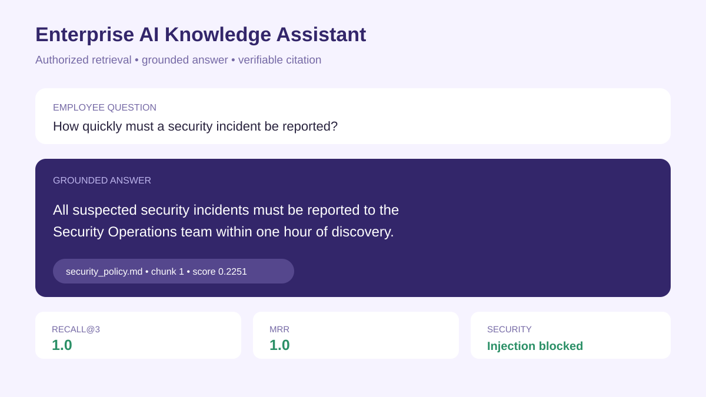
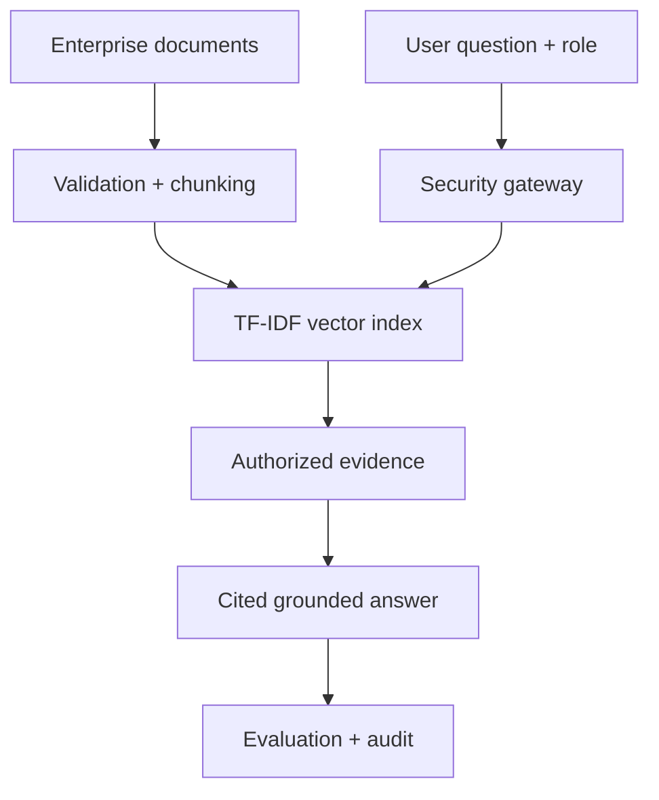

# Enterprise AI Knowledge Assistant

A secure, citation-first retrieval-augmented generation (RAG) portfolio project for answering questions from internal company documents.



## Business problem

Employees lose time searching scattered policies and operating procedures. Generic chatbots may hallucinate, expose restricted information, or obey malicious instructions hidden in documents. This assistant retrieves only authorized evidence, cites every answer, detects common prompt-injection patterns, and declines when evidence is insufficient.

## Architecture



## Capabilities

- Markdown and text-document ingestion
- Metadata-aware chunking
- Local TF-IDF vector retrieval with no API key required
- Document-level role-based access control
- Citation-first grounded answers
- Insufficient-evidence refusal
- Prompt-injection detection for questions and retrieved content
- Retrieval evaluation with Recall@K and Mean Reciprocal Rank
- FastAPI service, Docker, tests, and GitHub Actions
- AWS and Azure production architecture mappings

## Quick start

```bash
python -m venv .venv
source .venv/bin/activate  # Windows: .venv\\Scripts\\activate
pip install -r requirements.txt
python -m assistant_app.ingest --source knowledge --output artifacts/index.joblib
uvicorn assistant_app.api:app --reload
```

Open <http://localhost:8000/docs>.

## Example request

```json
{
  "question": "How quickly must a security incident be reported?",
  "role": "employee"
}
```

## API

| Endpoint | Purpose |
|---|---|
| `GET /health` | Index readiness |
| `POST /ask` | Retrieve authorized evidence and return a cited answer |
| `POST /evaluate` | Run retrieval-quality evaluation |

## Security model

- Documents declare allowed roles in front matter.
- Retrieval filters unauthorized chunks before ranking.
- The system treats retrieved documents as data, never as instructions.
- Suspicious instructions are flagged and excluded.
- The assistant refuses unsupported questions instead of inventing an answer.
- Production authentication must derive roles from trusted identity tokens, not request-body input.

## Cloud mapping

| Capability | AWS | Microsoft Azure |
|---|---|---|
| Document storage | S3 | Blob Storage / ADLS |
| Search | OpenSearch Serverless | Azure AI Search |
| LLM | Amazon Bedrock | Azure OpenAI |
| API | ECS/Fargate or Lambda | Container Apps or Functions |
| Identity | IAM Identity Center/Cognito | Microsoft Entra ID |
| Secrets | Secrets Manager | Key Vault |
| Monitoring | CloudWatch | Azure Monitor |

## Evaluation

```bash
python -m assistant_app.evaluate
```

The evaluation set checks whether the correct source appears in the top retrieved results and reports Recall@3 and Mean Reciprocal Rank.

## Responsible-AI notes

- Citations improve inspectability but do not guarantee correctness.
- Retrieval and generation should be evaluated separately.
- Sensitive documents require classification, retention, and access policies.
- User feedback and incident reporting should be logged without storing unnecessary personal data.
- High-impact decisions require human review.

## Interview walkthrough

1. Demonstrate role-based retrieval for employee and HR documents.
2. Show a grounded answer with source citations.
3. Ask an unsupported question and show the refusal.
4. Test a prompt-injection attempt and explain the control.
5. Run the evaluation suite and discuss production scaling.

## License

MIT
